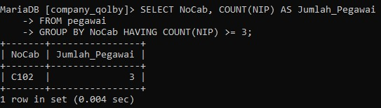

 **Ketentuan tabel: tipe data dan constraintnya :**  
- NIP: int & primary key
- NDep: varchar & NOT NULL
- NBlk: varchar
- JK: enum, NOT NULL
- Alamat: text, NOT NULL
- Telp: varchar, NOT NULL
- Jabatan: enum
- Gaji: BIGINT, NOT NULL
- NoCab: Varchar, NOT NULL
### Hasil Struktur tabel Pegawai 


(Hasil di PhpMYAdmin)


**Analisis Query :**  
- `desc pegawai ;` Kueri ini digunakan untuk menampilkan struktur tabel pegawai, 
termasuk nama kolom, tipe data, batasan null/bukan null, batasan kunci, nilai default, dan
informasi tambahan.
- `NIP` Bidang ini adalah tipe data integer dan bertindak sebagai
kunci utama untuk tabel. Bidang ini tidak boleh null, yang berarti bahwa setiap baris dalam
tabel harus memiliki nilai NIP yang unik.
- `NDep` Ini adalah kolom varchar yang menyimpan nama. Kolom ini tidak boleh null.
- `NBlk`  Ini adalah kolom varchar yang menyimpan nama belakang. Kolom ini tidak
boleh null, yang berarti bahwa setiap karyawan harus dikaitkan dengan belakang.
- `JK`  Ini adalah kolom enum yang menyimpan jenis kelamin karyawan,
dengan kemungkinan nilai 'L' (Laki-laki) atau 'P' (Perempuan). Kolom ini tidak boleh null,
yang berarti bahwa setiap karyawan harus memiliki jenis kelamin yang ditentukan.
- `Alamat` Ini adalah kolom teks yang menyimpan alamat karyawan. Kolom ini tidak boleh
kosong, yang berarti setiap karyawan harus memiliki alamat.
- `Telp (Telepon)` Ini adalah kolom varchar yang menyimpan nomor telepon karyawan.
Kolom ini tidak boleh kosong dan harus unik, yang berarti setiap karyawan harus memiliki
nomor telepon yang unik dan pastinya berbeda-beda.
- `Jabatan` Ini adalah kolom enum yang menyimpan posisi pekerjaan karyawan, dengan kemungkinan nilai 'Manajer', 'Sales', atau 'Staf'. Kolom ini tidak boleh kosong, yang
berarti bahwa setiap karyawan harus memiliki posisi pekerjaan yang ditentukan.
- `Gaji` Ini adalah kolom bigint yang menyimpan gaji karyawan. Kolom ini tidak
boleh null, yang berarti setiap karyawan harus memiliki gaji yang telah ditentukan.
- `NoCab` Ini adalah kolom varchar yang menyimpan nomor cabang. Kolom
ini tidak boleh null dan merupakan bagian dari indeks multikolom, yang berarti bahwa
kombinasi NoCab dan satu atau beberapa kolom lainnya harus unik.

**Kesimpulan Analisis Query:** 
Analisis ini memberikan contoh tentang bagaimana tabel `pegawai` diatur dan bagaimana data di dalamnya akan disimpan dan dikelola, termasuk kendali integritas data melalui penggunaan kunci utama dan indeks unik.
### Hasil data tabel Pegawai 

(Hasil di PhpMyAdmin)


**Analisis Query :** 
- **NIP (Nomor Induk Pegawai)**
Tipe Data : `int(10)` `NIP` adalah kunci utama yang unik untuk setiap pegawai. Nilai-nilai `NIP` berbeda untuk setiap pegawai, menunjukkan bahwa data ini berfungsi dengan baik sebagai pengidentifikasi unik.
- **NDep (Nama Depan)**
Tipe Data: `varchar(50)` Kolom ini menyimpan nama depan pegawai. Nama-nama seperti 'Emya', 'Diah', 'Dian', dll., semuanya valid dan konsisten.
- **NBlk (Nama Belakang)**
**Tipe Data**: `varchar(25)` Kolom ini menyimpan nama belakang pegawai. Nama-nama seperti 'Salsalina', 'Wahyuni', 'Anggraini', dll., semuanya valid dan konsisten.
- **JK (Jenis Kelamin)**
**Tipe Data**: `enum('L','P')`  Kolom ini menyimpan jenis kelamin pegawai, dengan 'L' untuk Laki-laki dan 'P' untuk Perempuan. Semua nilai dalam data ini sesuai dengan pilihan yang telah ditentukan.
- **Alamat** 
**Tipe Data**: `text` Kolom ini menyimpan alamat lengkap pegawai. Data alamat seperti 'Jl.Suci 78 Bandung', 'Jl.Maluku 56 Bandung', dll., menunjukkan format teks yang panjang, sesuai dengan kebutuhan penyimpanan informasi alamat.
- **Telp (Telepon)**
**Tipe Data**: `varchar(15)`
Kolom ini menyimpan nomor telepon pegawai. Data di sini adalah unik karena memiliki kunci unik (`UNI`), yang memastikan tidak ada dua pegawai dengan nomor telepon yang sama.
- **Jabatan**
**Tipe Data**: `enum('Manajer','Sales','Staf')`
Kolom ini menyimpan jabatan pegawai. Nilai yang ada seperti 'Manajer', 'Sales', dan 'Staf' semuanya valid sesuai dengan pilihan yang ditetapkan. Ada satu baris dengan nilai kosong, yang bisa menunjukkan bahwa jabatan belum ditentukan untuk pegawai tersebut.
- **Gaji**
**Tipe Data**: `bigint(25)`
 Kolom ini menyimpan gaji pegawai dengan kapasitas yang besar, sesuai dengan nilai-nilai yang ada (misalnya, 5250000, 2500000, dll.). Semua nilai gaji tampaknya valid dan konsisten dengan jenis data `bigint`.
- **NoCab (Nomor Cabang)**
**Tipe Data**: `varchar(10)` Kolom ini menyimpan nomor cabang tempat pegawai bekerja. Nilai seperti 'C101', 'C103', dan 'C104' menunjukkan bahwa pegawai dikelompokkan berdasarkan cabang, dengan beberapa pegawai yang memiliki cabang yang sama.

**Kesimpulan Analisis Query :**
Hasil dari query `SELECT * FROM pegawai` menunjukkan bahwa tabel `pegawai` memiliki struktur yang konsisten dengan informasi lengkap tentang pegawai. Kolom `NIP` bertindak sebagai kunci utama, memastikan bahwa setiap pegawai memiliki identifikasi unik, sementara kolom `Telp` juga memiliki kunci unik, mencegah adanya duplikasi nomor telepon.

### Select 
1.  SELECT COUNT
```sql
SELECT COUNT(NIP) AS JumlahPegawai, COUNT(Jabatan) AS JumlahJabatan FROM pegawai;
```

- `SELECT`  sebuah fungsi yang menghitung jumlah baris dalam kolom `NIP`dari tabel `pegawai`.
- `COUNT(NIP)`akan menghitung jumlah baris yang memiliki nilai di kolom `NIP`. Jadi, jika ada 9 baris dengan nilai yang valid di kolom `NIP`, maka hasilnya akan 9.
- `AS` untuk mengubah nama dari suatu kolom untuk sementara
- `JumlahPegawai` merupakan nama ubahan  dari perintah AS yang digunakan, dan nama sementara dari perintah `COUNT(NIP)`
- `COUNT(Jabatan)`akan menghitung jumlah baris yang memiliki nilai di kolom `Jabatan`. Jadi, jika ada 9 baris dengan nilai yang valid di kolom `Jabatan`, maka hasilnya akan 9.
- `AS` untuk mengubah nama dari suatu kolom untuk sementara
- `Jumlah Jabatan` merupakan nama sementara dari perintah `COUNT(Jabatan)`  
- `FROM pegawai;`Ini menunjukkan bahwa query ini yang akan dijalankan pada tabel `pegawai`.

Jadi, query ini akan mengembalikan dua kolom: `JumlahPegawai`yang berisi jumlah baris dengan nilai valid di kolom `NIP`, dan `JumlahJabatan`yang berisi jumlah baris dengan nilai valid di kolom `Jabatan`. Hasil query ini menunjukkan bahwa terdapat 9 pegawai dan 9 jabatan yang berbeda di dalam tabel `pegawai`. 


2. SELECT COUN, FROM, WHERE
```SQL
SELECT COUNT(NIP) AS JumlahPegawai
FROM pegawai
WHERE NoCab = 'C102';
```

- `SELECT` untuk memilih kolom apa saja yang ingin dipilih
- `COUNT(NIP)` menghitung jumlah baris data yang memiliki nilai isi data dari jolom yang dipilih `NIP` adalah nama kolom yang dipilih untuk dihitung
- `AS` untuk mengubah nama dari suatu kolom untuk sementara
- `JumlahPegawai` merupakan nama ubahan  dari perintah AS yang digunakan, dan nama sementara dari perintah `COUNT(NIP)`
- `FROM pegawai` Ini menunjukkan bahwa query ini yang akan dijalankan pada tabel `pegawai`.
- Ini menunjukkan bahwa query ini akan dijalankan pada tabel `pegawai`.
3. `WHERE` merupakan kondisi yang harus dipenuhi, jadi hanya barisan data ayng memiliki `C102` di kolom `NoCab` yang bisa dihitung

Jadi, query ini akan mengembalikan jumlah pegawai yang bekerja di cabang dengan nomor `'C102'`, yang dalam tabel ini adalah 3 orang.

3. SELECT COUNT, FROM, GROUP BY
```sql
SELECT NoCab, COUNT(NIP) AS Jumlah_Pegawai
FROM pegawai
GROUP BY NoCab;
```

- `SELECT` untuk memilih kolom apa saja yang ingin dipilih
- `NoCab`adalah nama kolom yang ingin ditampilkan.
- `COUNT(NIP)` menghitung jumlah baris data yang memiliki nilai isi data dari jolom yang dipilih `NIP` adalah nama kolom yang dipilih untuk dihitung
- `AS` untuk mengubah nama dari suatu kolom untuk sementara
- `JumlahPegawai` merupakan nama ubahan  dari perintah AS yang digunakan, dan nama sementara dari perintah `COUNT(NIP)`
- `FROM pegawai` Ini menunjukkan bahwa query ini yang akan dijalankan pada tabel `pegawai`.
- Ini menunjukkan bahwa query ini akan dijalankan pada tabel `pegawai`.
- `GROUP BY` untuk ngelompokkan data berdasarkan nilai data yang telah di tentukan pada kolom yang dipilih 
- `NoCab`adalah nama kolom yang ingin ditampilkan.

Hasil query ini menunjukkan jumlah pegawai untuk masing-masing cabang berdasarkan nilai `NoCab`. Terlihat bahwa:
- Cabang C101 memiliki 2 pegawai
- Cabang C102 memiliki 3 pegawai
- Cabang C103 memiliki 2 pegawai
- Cabang C104 memiliki 2 pegawai

4. SELECT SUM, FROM
```sql
SELECT NoCab, COUNT(NIP) AS Jumlah_Pegawai
FROM pegawai
GROUP BY NoCab HAVING COUNT(NIP) >= 3;
```

1. `SELECT SUM(Gaji) AS Total_Gaji`:
- `SUM(Gaji)`adalah sebuah fungsi yang menjumlahkan semua nilai di kolom `Gaji`tabel `pegawai`.
- Hasil penjumlahan ini diberi alias `Total_Gaji`.
2. `FROM pegawai`:
- Ini menunjukkan bahwa query ini akan dijalankan pada tabel `pegawai`.

Jadi, query ini akan menghitung total gaji dari semua pegawai yang ada di tabel `pegawai`. Hasil query menunjukkan bahwa total gaji seluruh pegawai adalah Rp 30.575.000.

5. SELECT SUM, FROM, WHERE
```sql
SELECT SUM(Gaji) AS Gaji_Manajer
FROM pegawai
WHERE Jabatan = 'Manajer';
```

1. `SELECT SUM(Gaji) AS Gaji_Manajer`:
- `SUM(Gaji)`adalah sebuah fungsi yang menjumlahkan semua nilai di kolom `Gaji`tabel `pegawai`.
- Hasil penjumlahan ini diberi alias `Gaji_Manajer`.
2. `FROM pegawai`:
- Ini menunjukkan bahwa query ini akan dijalankan pada tabel `pegawai`.
3. `WHERE Jabatan = 'Manajer'`:
- Ini adalah sebuah _filter_ yang akan menyeleksi hanya baris-baris yang memiliki nilai 'Manajer' di kolom `Jabatan`.
- Jadi, query ini akan menjumlahkan gaji hanya untuk pegawai yang memiliki jabatan sebagai Manajer.

Hasil query ini menunjukkan bahwa total gaji untuk seluruh pegawai yang berjabatan sebagai Manajer adalah Rp 17.250.000.

6. SELECT, FROM, GROUP BY
```SQL
SELECT NoCab, SUM(Gaji) AS TotalGaji
FROM pegawai
GROUP BY NoCab;
```

1. `SELECT NoCab, SUM(Gaji) AS TotalGaji`:
- `NoCab`adalah kolom yang akan diambil nilai-nilainya.
- `SUM(Gaji) AS TotalGaji`adalah sebuah fungsi yang menjumlahkan semua nilai di kolom `Gaji`untuk masing-masing nilai `NoCab`. Hasilnya akan diberi alias `TotalGaji`.
2. `FROM pegawai`:
- Ini menunjukkan bahwa query ini akan dijalankan pada tabel `pegawai`.
3. `GROUP BY NoCab`:
- Ini adalah _grouping Clause_ yang akan mengelompokkan baris-baris berdasarkan nilai pada kolom `NoCab`.
- Jadi, `SUM(Gaji)`akan dihitung untuk masing-masing nilai unik di kolom `NoCab`.

Hasil query ini menunjukkan total gaji untuk masing-masing cabang berdasarkan nilai `NoCab`. Terlihat bahwa:
- Cabang C101 memiliki total gaji Rp 7.750.000
- Cabang C102 memiliki total gaji Rp 9.450.000
- Cabang C103 memiliki total gaji Rp 9.000.000
- Cabang C104 memiliki total gaji Rp 4.375.000

7. SELECT, FROM, GROUP BY, HAVING
```sql
SELECT NoCab, SUM(Gaji) AS Total_Gaji
FROM pegawai
GROUP BY NoCab
HAVING SUM(Gaji) >= 8000000;
```

1. `SELECT NoCab, SUM(Gaji) AS Total_Gaji`:
- `NoCab`adalah kolom yang akan diambil nilai-nilainya.
- `SUM(Gaji) AS Total_Gaji`adalah sebuah fungsi yang menjumlahkan semua nilai di kolom `Gaji`untuk masing-masing nilai `NoCab`. Hasilnya akan diberi alias `Total_Gaji`.
2. `FROM pegawai`:
- Ini menunjukkan bahwa query ini akan dijalankan pada tabel `pegawai`.
3. `GROUP BY NoCab`:
- Ini adalah _grouping Clause_ yang akan mengelompokkan baris-baris berdasarkan nilai pada kolom `NoCab`.
- Jadi, `SUM(Gaji)`akan dihitung untuk masing-masing nilai unik di kolom `NoCab`.
4. `HAVING SUM(Gaji) >= 8000000`:
- Ini adalah sebuah filter yang akan menyeleksi hanya kelompok-kelompok yang memiliki total gaji ( `SUM(Gaji)`) lebih besar atau sama dengan Rp 8.000.000.

Hasil query ini menunjukkan bahwa hanya ada 2 cabang yang memiliki total gaji lebih besar atau sama dengan Rp 8.000.000, yaitu:
- Cabang C102 dengan total gaji Rp 9.450.000
- Cabang C103 dengan total gaji Rp 9.000.000

8. SELECT AVG
```sql
SELECT AVG(Gaji) AS Rata_rata
FROM pegawai;
```

1. `SELECT AVG(Gaji) AS Rata_rata`:
- `AVG(Gaji)`adalah sebuah fungsi yang menghitung rata-rata nilai di kolom `Gaji`dari tabel `pegawai`.
- Hasil perhitungan rata-rata ini diberi alias `Rata_rata`.
2. `FROM pegawai`:
- Ini menunjukkan bahwa query ini akan dijalankan pada tabel `pegawai`.

Jadi, query ini akan menghitung rata-rata gaji dari semua pegawai yang ada di tabel `pegawai`.
Hasil query menunjukkan bahwa rata-rata gaji pegawai adalah Rp 3.397.222,22.

9. SELECT, FROM, WHERE
```sql
SELECT AVG(Gaji) AS RataMgr
FROM pegawai
WHERE Jabatan = 'Manajer';
```

1. `SELECT AVG(Gaji) AS RataMgr`:
- `AVG(Gaji)`adalah sebuah fungsi yang menghitung rata-rata nilai di kolom `Gaji`dari tabel `pegawai`.
- Hasil perhitungan rata-rata ini diberi alias `RataMgr`.
2. `FROM pegawai`:
- Ini menunjukkan bahwa query ini akan dijalankan pada tabel `pegawai`.
3. `WHERE Jabatan = 'Manajer'`:
- Ini adalah sebuah filter yang akan menyeleksi hanya baris-baris yang memiliki nilai `'Manajer'`di kolom `Jabatan`.

Jadi, query ini akan menghitung rata-rata gaji dari semua pegawai yang memiliki jabatan sebagai Manajer.
Hasil query menunjukkan bahwa rata-rata gaji pegawai yang berjabatan sebagai Manajer adalah Rp 5.750.000.

10. SELECT AVG, FROM, GROUP BY
```sql
SELECT NoCab, AVG(Gaji) AS RataGaji
FROM pegawai
GROUP BY NoCab;
```

1. `SELECT NoCab, AVG(Gaji) AS RataGaji`:
- `NoCab`adalah kolom yang akan diambil nilai-nilainya.
- `AVG(Gaji) AS RataGaji`adalah sebuah fungsi yang menghitung rata-rata nilai di kolom `Gaji`untuk masing-masing nilai `NoCab`. Hasilnya akan diberi alias `RataGaji`.
2. `FROM pegawai`:
- Ini menunjukkan bahwa query ini akan dijalankan pada tabel `pegawai`.
3. `GROUP BY NoCab`:
- Ini adalah _grouping Clause_ yang akan mengelompokkan baris-baris berdasarkan nilai pada kolom `NoCab`.
- Jadi, `AVG(Gaji)`akan dihitung untuk masing-masing nilai unik di kolom `NoCab`.

Hasil query ini menunjukkan rata-rata gaji pegawai untuk masing-masing cabang:
- Cabang C101: Rp 3.875.000
- Cabang C102: Rp 3.150.000
- Cabang C103: Rp 4.500.000
- Cabang C104: Rp 2.187.500

11. SELECT, FROM, GROUP BY, HAVING
```sql
SELECT NoCab, AVG(Gaji) AS RataGaji
FROM pegawai
GROUP BY NoCab
HAVING NoCab = 'C101' OR NoCab = 'C102';
```

1. `SELECT NoCab, AVG(Gaji) AS RataGaji`:
- `NoCab`adalah kolom yang akan diambil nilai-nilainya.
- `AVG(Gaji) AS RataGaji`adalah sebuah fungsi yang menghitung rata-rata nilai di kolom `Gaji`untuk masing-masing nilai `NoCab`. Hasilnya akan diberi alias `RataGaji`.
2. `FROM pegawai`:
- Ini menunjukkan bahwa query ini akan dijalankan pada tabel `pegawai`.
3. `GROUP BY NoCab`:
- Ini adalah _grouping Clause_ yang akan mengelompokkan baris-baris berdasarkan nilai pada kolom `NoCab`.
- Jadi, `AVG(Gaji)`akan dihitung untuk masing-masing nilai unik di kolom `NoCab`.
4. `HAVING NoCab = 'C101' OR NoCab = 'C102'`:
- Ini adalah filter yang akan menyeleksi hanya baris-baris yang memiliki nilai `'C101'`atau `'C102'`di kolom `NoCab`.
- `HAVING`digunakan karena filter ini diterapkan setelah proses pengelompokan ( `GROUP BY`).

Hasil query ini menunjukkan rata-rata gaji pegawai hanya untuk cabang C101 dan C102:
- Cabang C101: Rp 3.875.000
- Cabang C102: Rp 3.150.000

12.  SELECT MAX
```sql
SELECT MAX(Gaji) AS GajiTerbesar, MIN(Gaji) AS GajiTerkecil
FROM pegawai;
```

1. `SELECT MAX(Gaji) AS GajiTerbesar, MIN(Gaji) AS GajiTerkecil`:
- `MAX(Gaji)`adalah sebuah fungsi yang mengembalikan nilai terbesar dari kolom `Gaji`.
- `MIN(Gaji)`adalah sebuah fungsi yang mengembalikan nilai terkecil dari kolom `Gaji`.
- Hasil dari kedua fungsi ini masing-masing diberi alias `GajiTerbesar`dan `GajiTerkecil`.
2. `FROM pegawai`:
- Ini menunjukkan bahwa query ini akan dijalankan pada tabel `pegawai`.

Hasil query ini menunjukkan bahwa:
- Gaji terbesar di antara semua pegawai adalah Rp 6.250.000.
- Gaji terkecil di antara semua pegawai adalah Rp 1.725.000.

13. SELECT MAX
```sql
SELECT MAX(Gaji) AS GajiTerbesar, MIN(Gaji) AS GajiTerkecil
FROM pegawai
WHERE Jabatan = 'Manajer';
```

1. `SELECT MAX(Gaji) AS GajiTerbesar, MIN(Gaji) AS GajiTerkecil`:
- `MAX(Gaji)`adalah sebuah fungsi yang mengembalikan nilai terbesar dari kolom `Gaji`.
- `MIN(Gaji)`adalah sebuah fungsi yang mengembalikan nilai terkecil dari kolom `Gaji`.
- Hasil dari kedua fungsi ini masing-masing diberi alias `GajiTerbesar`dan `GajiTerkecil`.
2. `FROM pegawai`:
- Ini menunjukkan bahwa query ini akan dijalankan pada tabel `pegawai`.
3. `WHERE Jabatan = 'Manajer'`:
- Ini adalah _filter_ yang akan menyeleksi hanya baris-baris yang memiliki nilai `'Manajer'`di kolom `Jabatan`.

Hasil query ini menunjukkan bahwa: 
- Gaji terbesar di antara para manajer adalah Rp 6.250.000.
- Gaji terkecil di antara para manajer adalah Rp 5.250.000.

14.  SELECT, FROM, GROUP BY
```sql
SELECT NoCab, MAX(Gaji) AS GajiTerbesar, MIN(Gaji) AS GajiTerkecil
FROM pegawai
GROUP BY NoCab;
```

1. `SELECT NoCab, MAX(Gaji) AS GajiTerbesar, MIN(Gaji) AS GajiTerkecil`:
- `NoCab`adalah kolom yang akan diambil nilai-nilainya.
- `MAX(Gaji) AS GajiTerbesar`adalah sebuah fungsi yang menghitung nilai terbesar di kolom `Gaji`untuk masing-masing nilai `NoCab`. Hasilnya akan diberi alias `GajiTerbesar`.
- `MIN(Gaji) AS GajiTerkecil`adalah sebuah fungsi yang menghitung nilai terkecil di kolom `Gaji`untuk masing-masing nilai `NoCab`. Hasilnya akan diberi alias `GajiTerkecil`.
2. `FROM pegawai`:
- Ini menunjukkan bahwa query ini akan dijalankan pada tabel `pegawai`.
3. `GROUP BY NoCab`:
- Ini adalah _grouping Clause_ yang akan mengelompokkan baris-baris berdasarkan nilai pada kolom `NoCab`.
- Jadi, `MAX(Gaji)`dan `MIN(Gaji)`akan dihitung untuk masing-masing nilai unik di kolom `NoCab`.

Hasil query ini menunjukkan:
 Untuk cabang C101:
- Gaji terbesar: Rp 5.250.000
- Gaji terkecil: Rp 2.500.000
 Untuk cabang C102:
- Gaji terbesar: Rp 5.750.000
- Gaji terkecil: Rp 1.750.000
 Untuk cabang C103:
- Gaji terbesar: Rp 6.250.000
- Gaji terkecil: Rp 2.750.000
 Untuk cabang C104:
- Gaji terbesar: Rp 2.650.000
- Gaji terkecil: Rp 1.725.000

15. SELECT, FROM, GROUP BY, HAVING COUNT
```sql
SELECT NoCab, MAX(Gaji) AS GajiTerbesar, MIN(Gaji) AS GajiTerkecil
FROM pegawai
GROUP BY NoCab
HAVING COUNT(NIP) >= 3;
```

1. `SELECT NoCab, MAX(Gaji) AS GajiTerbesar, MIN(Gaji) AS GajiTerkecil`:
- `NoCab`adalah kolom yang akan diambil nilai-nilainya.
- `MAX(Gaji) AS GajiTerbesar`adalah sebuah fungsi yang menghitung nilai terbesar di kolom `Gaji`untuk masing-masing nilai `NoCab`. Hasilnya akan diberi alias `GajiTerbesar`.
- `MIN(Gaji) AS GajiTerkecil`adalah sebuah fungsi yang menghitung nilai terkecil di kolom `Gaji`untuk masing-masing nilai `NoCab`. Hasilnya akan diberi alias `GajiTerkecil`.
2. `FROM pegawai`:
- Ini menunjukkan bahwa query ini akan dijalankan pada tabel `pegawai`.
3. `GROUP BY NoCab`:
- Ini adalah _grouping Clause_ yang akan mengelompokkan baris-baris berdasarkan nilai pada kolom `NoCab`.
- Jadi, `MAX(Gaji)`dan `MIN(Gaji)`akan dihitung untuk masing-masing nilai unik di kolom `NoCab`.
4. `HAVING COUNT(NIP) >= 3`:
- Ini adalah _filter_ yang akan menyeleksi hanya kelompok-kelompok yang memiliki jumlah baris (dihitung berdasarkan `NIP`) lebih besar atau sama dengan 3.

Hasil query ini menunjukkan bahwa hanya ada satu cabang (C102) yang memiliki jumlah pegawai minimal 3, dengan:
- Gaji terbesar: Rp 5.750.000
- Gaji terkecil: Rp 1.750.000

16.  SELECT COUNT
```sql
SELECT COUNT(NIP) AS JumlahPegawai, 
       SUM(Gaji) AS TotalGaji,
       AVG(Gaji) AS RataGaji,
       MAX(Gaji) AS GajiMaks,
       MIN(Gaji) AS Gajimin
FROM pegawai;
```

1. `SELECT COUNT(NIP) AS JumlahPegawai`:
- Ini menghitung jumlah baris (pegawai) dalam tabel `pegawai`menggunakan fungsi agregat `COUNT(NIP)`.
- Hasilnya akan diberikan alias `JumlahPegawai`.
2. `SUM(Gaji) AS TotalGaji`:
- Ini menghitung total gaji seluruh pegawai menggunakan fungsi agregat `SUM(Gaji)`.
- Hasilnya akan diberikan alias `TotalGaji`.
3. `AVG(Gaji) AS RataGaji`:
- Ini menghitung rata-rata gaji pegawai menggunakan fungsi agregat `AVG(Gaji)`.
- Hasilnya akan diberikan alias `RataGaji`.
4. `MAX(Gaji) AS GajiMaks`:
- Ini menghitung gaji terbesar menggunakan fungsi agregat `MAX(Gaji)`.
- Hasilnya akan diberikan alias `GajiMaks`.
5. `MIN(Gaji) AS Gajimin`:
- Ini menghitung gaji terkecil menggunakan fungsi agregat `MIN(Gaji)`.
- Hasilnya akan diberikan alias `Gajimin`.
6. `FROM pegawai`:
- Ini menunjukkan bahwa query ini akan dijalankan pada tabel `pegawai`.

Hasil query ini menunjukkan:
- Jumlah pegawai: 9
- Total gaji seluruh pegawai: Rp 30.575.000
- Rata-rata gaji pegawai: Rp 3.397.222,22
- Gaji terbesar: Rp 6.250.000
- Gaji terkecil: Rp 1.725.000

17. SELECT COUNT, FROM, WHERE, GROUP BY, HAVING
```sql
SELECT COUNT(NIP) AS JumlahPegawai, 
       SUM(Gaji) AS TotalGaji,
       AVG(Gaji) AS RataGaji,
       MAX(Gaji) AS GajiMaks,
       MIN(Gaji) AS Gajimin
FROM pegawai
WHERE Jabatan = 'Staf' OR Jabatan = 'Sales'  
GROUP BY NoCab
HAVING SUM(Gaji) <= 2600000;
```

1. `SELECT COUNT(NIP) AS JumlahPegawai, SUM(Gaji) AS TotalGaji, AVG(Gaji) AS RataGaji, MAX(Gaji) AS GajiMaks, MIN(Gaji) AS Gajimin`:
- Ini adalah bagian yang sama dengan query sebelumnya, menghitung jumlah pegawai, total gaji, rata-rata gaji, gaji terbesar, dan gaji terkecil.
2. `FROM pegawai`:
- Ini menunjukkan bahwa query ini akan dijalankan pada tabel `pegawai`.
3. `WHERE Jabatan = 'Staf' OR Jabatan = 'Sales'`:
- Ini adalah filter yang hanya akan mengambil data pegawai yang memiliki jabatan 'Staf' atau 'Sales'.
4. `GROUP BY NoCab`:
- Ini adalah _grouping Clause_ yang akan mengelompokkan baris-baris berdasarkan nilai pada kolom `NoCab`.
- Jadi, `COUNT(NIP)`, `SUM(Gaji)`, `AVG(Gaji)`, `MAX(Gaji)`, dan `MIN(Gaji)`akan dihitung untuk masing-masing nilai unik di kolom `NoCab`.
5. `HAVING SUM(Gaji) <= 2600000`:
- Ini adalah  filter yang akan menyeleksi hanya kelompok-kelompok yang memiliki total gaji kurang dari atau sama dengan Rp 2.600.000.

Hasil query ini menunjukkan bahwa ada 2 cabang (NoCab) yang memiliki total gaji pegawai 'Staf' atau 'Sales' kurang dari atau sama dengan Rp 2.600.000, dengan rincian:
 Cabang 1:
- Jumlah pegawai: 1
- Total gaji: Rp 2.500.000
- Gaji rata-rata: Rp 2.500.000
- Gaji terbesar: Rp 2.500.000
- Gaji terkecil: Rp 2.500.000
 Cabang 2:
- Jumlah pegawai: 1
- Total gaji: Rp 1.725.000
- Gaji rata-rata: Rp 1.725.000
- Gaji terbesar: Rp 1.725.000
- Gaji terkecil: Rp 1.725.000

